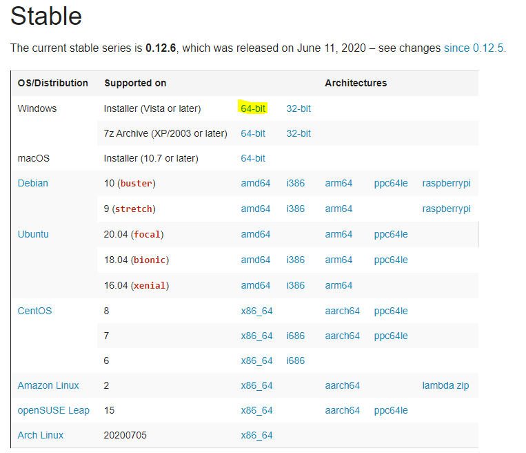

# Installation

- First, you have to install "pdfkit" using pip.
```bash
pip install pdfkit
```

- Second, you have to install wkhtmltopdf [[link]](https://github.com/JazzCore/python-pdfkit/wiki/Installing-wkhtmltopdf).



# Examples
## 1. Export pdf from url
```python
import pdfkit

# Set path you installed.
path_wkhtmltopdf = 'C:/Program Files/wkhtmltopdf/bin/wkhtmltopdf.exe'
config = pdfkit.configuration(wkhtmltopdf=path_wkhtmltopdf)

# Convert google.pdf from url, which is http://google.co.kr/.
pdfkit.from_url("http://google.co.kr", "google.pdf", configuration=config)
```

